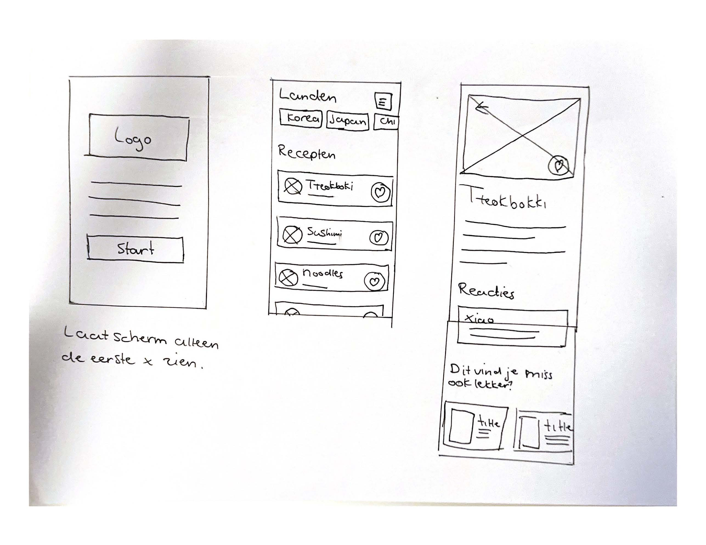
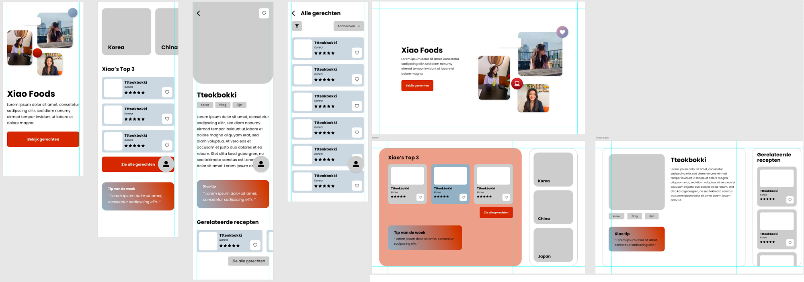
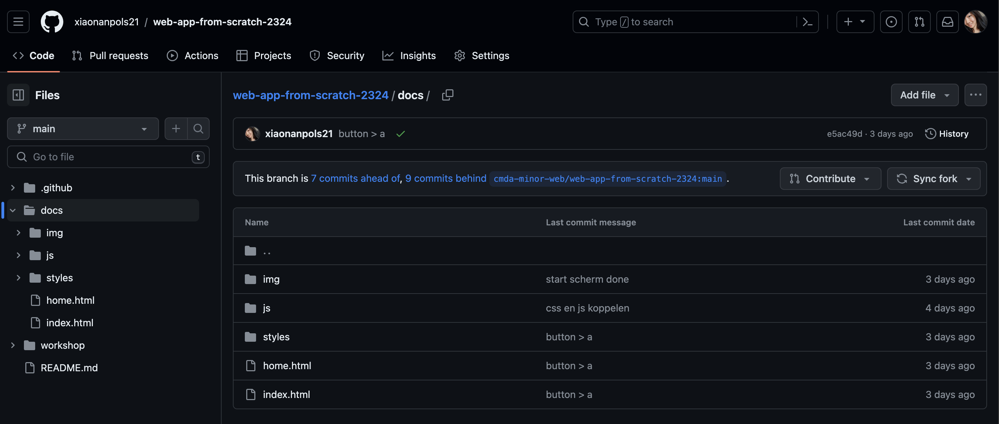
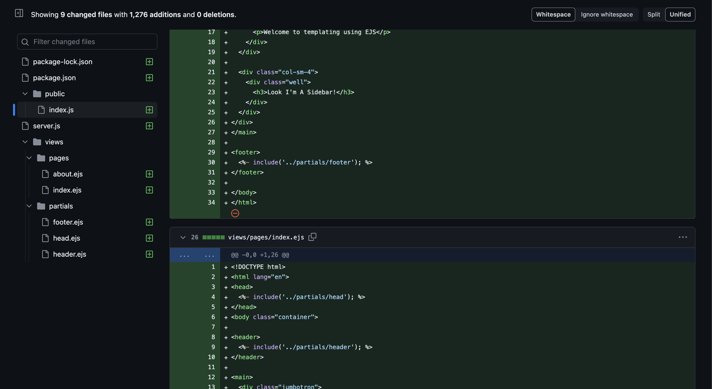

# WAFS-2.0

## Uitgelegde code
Voor al mijn code en bepaalde problemen, heb ik een [WIKI](https://github.com/xiaonanpols21/WAFS-2.0/wiki) aangemaakt waarin ik dat zal behandelen. 

Voor bepaalde onderdelen heb ik gebruik gemaakt van Chat GPT. Op die plekken staat een URL met de PROMPTS. Alle PROMPTS en precies waar is hier te vinden: Chat [GPT PROMPTS](https://chemical-bunny-323.notion.site/Chat-GPT-Documentatie-d93ea570990b4754bec559e9bfcc2217?pvs=25)

## Intro
Voor dit project ga ik een recepten app maken waarbij gerechten komen uit Azië. 

Landen die meegenomen worden tot nu toe:
- Korea
- China
- Japan

**Mogelijke functies in de app**
Sorteren
-	A – Z
-	Populaire

Filteren
-	Landen
-	Ingrediënten

- Liken
- (Delen)
- Badges
- (Reacties)

**De app**
De app wil ik Xiao foods noemen waarbij het startscherm informatie geeft over de auteur

- Naam
- Foto
- Bio
- Call to action button

## Schetsen

Ik maakte eerst een simpele schets van wat mijn idee was. Een start scherm om de gebruiker voor het eerst te verwelkomen, een home page waarbij de gerechten worden gezien en dat je kan filteren op land. En dan als laatste een single page van de gerechten. 

## Design

Op 6 feb hadden we een stand-up met docent. Ik liet mijn design zien met wat ik tot nu toe had gemaakt. Hij vond dat ik best wel veel had voor zo’n korte tijd. Docent stelde voor om alleen de home pagina te doen met cards linken naar een pagina met dat ene gerecht. Door zijn suggestie heb ik besloten om alleen het startscherm te laten zien en de home pagina met de gerechten en de single pages van de gerechten

## EJS
Op 6 februari was er een workshop over EJS. Ik deed mee met de docent zijn live tutorial waardoor ik nu EJS ga gebruiken voor mijn persoonlijke project. Ik heb Blok Tech gedaan waardoor ik eerder heb gewerkt met EJS. 

Ik wil EJS gebruiken zodat ik met partials kan werken en om data te genereren op de front-end. Als ik tijd over heb, wil ik Single pages maken van elk gerecht. 

## Data
De data die ik ga fetchen voor mijn recepten komen van: [RAPID API Food recipes with Images](https://rapidapi.com/zilinskivan/api/food-recipes-with-images/)

Data die hier vandaan komt, heeft een gratis licentie voor een paar dagen. Net zoals bij het thema semester Information Design, sla ik de JSON file op en zet hem in het mapje public en wordt de data daar vandaan gefetcht, maar oorspronkelijk komt de data van Rapid API. 

Ik had bepaalde code geschreven om de data te fetchen. Ik vond het best wel veel code dus ik vroeg aan docent of hij mij kon helpen om het korter te schrijven met 2 andere voorbeelden. Hij zei dat ik mij beter kon focussen om verder te werken aan project en om later te werken aan optimalisatie. Dus ik heb de code zo ge laten en ben verder gegaan met het bewerken van de data. 

**Origineel fetchen:**
```js
const url = 'https://food-recipes-with-images.p.rapidapi.com/?q=korea';
const options = {
    method: 'GET',
    headers: {
        'X-RapidAPI-Key': 'c20e05d39emsh51bf7509082730ep146d0cjsn622276aaec1a',
        'X-RapidAPI-Host': 'food-recipes-with-images.p.rapidapi.com'
    }
};

async function fetchData() {
    try {
        const response = await fetch(url, options);
        const result = await response.json();
        console.log(result);
    } catch (error) {
        console.error(error);
    }
}

fetchData();
```

**Nieuw fetchen:**
```js

async function fetchData() {
  try {
    const koreaData = await readFile('./public/data/korea.json');
    const chinaData = await readFile('./public/data/china.json');
    const japanData = await readFile('./public/data/japan.json');

    // Combine the data from all JSON files into a single array or object
    const combinedData = {
        korea: JSON.parse(koreaData),
        china: JSON.parse(chinaData),
        japan: JSON.parse(japanData)
    };
    console.log(combinedData);

  } catch (error) {
        console.error(error);
    }
}

```

## Voortgang


## Versies
### Versie 1
Oorspronkelijk begon ik met een repo die ik geforkt had van [WAFS](https://github.com/xiaonanpols21/web-app-from-scratch-2324) Daarin stopte ik al mijn gemaakte werk in docs als main root. Maar met de EJS workshop van docent had ik besloten om met EJS te gaan werken. Daardoor dacht ik dat het beter was om schoon te beginnen en om een nieuwe repo aan te maken. Daarom heet mijn huidige repo ook 2.0



De gemaakte code ik in de vorige repo had geplaatst ging ik gewoon kopiëren en plakken naar de huidige repo. 

